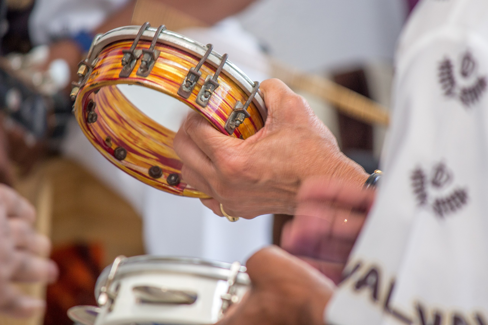

Since the beginning of the twentieth century, the dominant musical form in the Brazilian cultural sphere has been popular song, or *canção popular* (often shortened to *canção*, or "song"). The term encompasses a range of song-based musical genres, from the poignant midcentury ballads of *samba-canção* to widely circulating contemporary styles such as *sertanejo*.[^1] Studies of Brazilian popular song typically focus on the work of individual singer-songwriters, or *cancionistas*, on whom literature on the subject is predominantly concentrated.[^2] In addition to shaping the invention of new song-based genres over time, these figures also acted as cultural commentators throughout periods of social and political crisis, whether in opposition to the 1964-85 military dictatorship or speaking out against racial inequality. Through their recordings, they also acted as ambassadors for creating notions of a common Brazilian musical language as well as a sense of unity across the country's diverse panorama of cultures and communities, from the interior towns of the arid Northeastern *sertão* to the hillside neighborhoods of Rio de Janeiro. As this chapter will show, even as popular song has maintained certain core structural qualities, it has long acted as a site for political contestation, social commentary, creative transformation, and the construction of national identity. To examine popular song and its various constituent genres is to gain a window into Brazilian cultural politics over time and the creative strategies musicians have employed to participate in these societal shifts.

[^1]: For a discussion of the nuances of the Portuguese language term *canção* and how it differs from the more general English language term "song," see McNally 2021, 128.

[^2]: See, e.g., Napolitano 2001; Tatit 1996; 2002; 2004. The term *cancionista* was most prominently introduced and pioneered by Luiz Tatit.

## The Early Years

Brazilian popular song first appeared in national media in the late 1910s and 1920s with the introduction of early recording technology. Samba, along with related genres such as *maxixe*, constituted an early stylistic template for the form.[^3] Scholar and songwriter Luiz Tatit identifies the "encounter between *sambistas* and the gramophone" in the late 1910s as a starting point for "what we know today as *popular song*" (Tatit 2004:35). These developments took place during the ascendance of musical nationalist sentiments that began to look toward local folk and popular practices as sources for musical representations of the Brazilian nation (see, e.g., Arinos 1917, 891). It is worth noting that in Brazil, the Portuguese term *popular* has historically encompassed folk and traditional musics as well as those circulated in mass media. Journalist Afonso Arinos, for instance, writing in 1917, argued that a "great anonymous power---almost subterranean, so to speak, like the action of the water table in the formation of the riverbank---configures the cultural fabric of our nationality, with its common legends and traditions, flying from South to North and from North to South on the shimmering wings of popular song" (891).

Ernesto "Donga" dos Santos's "Pelo Telefone" (1917; "On the Telephone," considered to be the first recorded samba song) and José "Sinhô" Barbosa da Silva's "Quem São Eles?" ("Who Are They?") provide characteristic instances of early popular songs during this period.[^4] Although songwriters typically did not include overtly political content, subtle social commentary was common. "Pelo Telefone," for instance, obliquely satirized police corruption, although the explicit nature of the critique became less overt as the song was adapted into its recorded version (Hertzman 2013, 100).

[^3]: Early samba drew heavily from creolized urban dance genres circulating in late-nineteenth and early-twentieth century Rio de Janeiro such as *maxixe*, *tango brasileiro,* and the instrumental genre of *choro,* all of which mixed Afro-Brazilian practices with genres circulating in the broader international sphere, both within and beyond Latin America.

[^4]: As was common during this period, the specific generic configuration of early popular songs was often ambiguous; Marc Hertzman, for instance, notes that in the case of "Pelo Telefone," "a broad range of terms were originally used to describe the song, including samba, samba carnavalesco, tango, tango-samba carnavalesco, modinha, and canção" (2013, 96).

### Nationalist Narratives

Popular song became an increasingly central medium for social discourse in the 1930s and early 1940s, during which President Getúlio Vargas's Estado Novo (New State) regime incentivized the production of popular songs with nationalistic themes. Genres of samba remained key stylistic sites for this project. In Carnival, *samba-enredo* (theme samba) acted as a vehicle for songs that celebrated the Brazilian nation. This phenomenon was particularly concentrated in the then-capital city of Rio de Janeiro, where iconic samba schools such as Portela and Mangueira debuted songs with themes that circulated on a national level (see Video 1). Many of the most prominent songs of the era, which overlapped with Brazil's participation in World War II, were highly nationalistic in nature. Portela, for instance, won seven consecutive awards for their mid-1940s themes, "Dez Anos de Glória" ("Ten Years of Glory"), "A Vida do Samba" ("The Life of Samba"), "Brasil, Terra de Liberdade" ("Brazil, Land of Freedom"), "Motivos Patrióticos" ("Patriotic Motives"), "Brasil Glorioso" ("Glorious Brazil"), "Alvorada do Novo Mundo" ("Dawn of the New World"), and "Honra ao Mérito" ("Honor to Merit").[^5] Popular songs also played a major role in disseminating ideologies of *mestiçagem* (mixture), which celebrated cultural mixture and presented Brazil as a fundamentally mixed-race nation. To this end, popular song also forwarded the notion of racial democracy, or the idea that Brazil enjoyed harmony between its various racial and ethnic groups---an ideal that would later come under fire during the Brazilian Black Consciousness movement. 

[^5]: Araújo 2012, 114. Jackson Raymundo identifies the Rio Carnival as a key site for the dissemination of songs that solidified certain universalizing themes about *brasilidade* (Brazilianness) , having to do with "culture, history, geography, ethnic formation, cuisine, \[...\] the different regions of the country, and 'national heroes'" (2019, 124).

<iframe width="560" height="315" src="https://www.youtube.com/embed/9rA3h9IODzU" title="YouTube video player" frameborder="0" allow="accelerometer; autoplay; clipboard-write; encrypted-media; gyroscope; picture-in-picture" allowfullscreen></iframe>

 
<small>*Figure 1. Tamborim. By [Rodrigo.Argenton](href="//commons.wikimedia.org/wiki/User:Rodrigo.Argenton" title="User:Rodrigo.Argenton"), [CC BY-SA 4.0](https://creativecommons.org/licenses/by-sa/4.0), [Link](https://commons.wikimedia.org/w/index.php?curid=45698284)*</small>

As radio and television became more integrated into Brazilian daily life, recorded genres of samba such as *samba-canção* (song samba) and *samba-exaltação* (exaltation samba) brought nationalist narratives into the Brazilian home. Certain popular songs of this period, such as Ary Barroso's "Aquarela do Brasil" ("Watercolor of Brazil") and Dorival Caymmi's "Samba da Minha Terra" ("Samba of My Land") have since become iconic examples of both the Brazilian popular songbook and the broader cultural project of nation-building that took place during and after the Vargas regime. Like their counterparts in samba schools, these songwriters often extolled the cultural diversity of Brazil and propagated narratives of racial harmony. By celebrating Brazil as a mixed-race nation, popular songs of the era formed a marked contrast to early twentieth-century Eurocentric conceptions of nationhood; at the same time, many predominantly white composers and musicians adopted an objectifying gaze towards Black people, music, and culture. The introduction to "Aquarela do Brasil," for instance, declared, "Brazil, my Brazilian Brazil / My intriguing *mulata* / I shall sing of you in my verses." This formed part of a broader pattern in which many of the samba songwriters who celebrated Black Brazilian cultural practices did not hail from the Afro-Brazilian communities from which samba came. This reflected the unequal access Afro-descendent musicians in Brazil had to full participation in the culture industry when compared to their white counterparts.
