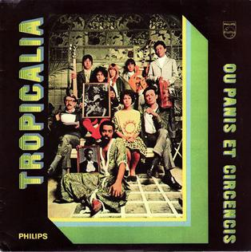
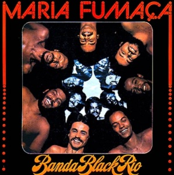

<a href="index.html" class="btn">Back to Part 1</a>
<a href="references.html" class="btn">References and discussion questions</a>

The mid-1950s saw the first of a series of seismic social and political shifts that would transform Brazilian musical culture on a foundational level. From 1956 to 1960, as part of national modernization efforts, President Juscelino Kubitschek led a successful push to build a planned city called Brasília to serve as Brazil's capital, moving the political center from Rio de Janeiro. Then, in 1964, in response to progressive economic reforms by democratically-elected left-wing President João Goulart, the Brazilian military enacted a *coup d'état* and installed a military dictatorship that would last for twenty-one years. Despite the restrictions of the military regime, the dictatorship saw the emergence of a powerful network of Black activists, writers, and artists that would become known as the Brazilian Black Consciousness Movement. Across each of these moments, Brazilian popular song acted as a key site for political activism and social commentary. The latter half of the twentieth century also saw the emergence of new musical genres from artists who were reconfiguring existing Brazilian musical practices in new and transformative ways. This engagement with international styles reflected the country's lasting dialogue with cultural producers in the broader global sphere.

## Bossa Nova

In the late 1950s, the Brazilian popular music sphere was upended by the emergence of bossa nova. Based in Rio de Janeiro and led by figures such as composer Antonio Carlos "Tom" Jobim, lyricist Vinicius de Moraes, and guitarist and vocalist João Gilberto, bossa nova reinvented the profile of Brazilian popular song. Certain core elements of the genre maintained stylistic elements from samba: Gilberto famously incorporated characteristic *tamborim* patterns from parading samba groups into the iconic "stuttering" pattern of his guitar---a motif that is apparent in the first recorded bossa nova song, "Chega de Saudade" ("No More Longing"; see Reily 1996, 4-5). Other elements departed in more marked ways. Gilberto's soft, nasal vocal timbre represented a sharp contrast with the belting style of Carnival and the rich delivery common in *samba-canção*.[^8] Jobim incorporated complex melodic and harmonic qualities that drew from modernist composition and jazz---a combination that inspired Jobim, Gilberto, and de Moraes's ironic song "Desafinado" ("Out of Tune"). Bossa nova songs often digressed from the overtly nationalist lyrical subject matter of previous eras, opting instead for low-key portraits of upper-middle class life in Rio's cosmopolitan Zona Sul (South Zone). These themes were perhaps best encapsulated in Jobim, de Moraes, and Gilberto's "Garôta de Ipanema" ("The Girl from Ipanema"), performed by Gilberto in collaboration with singer Astrud Gilberto and US saxophonist Stan Getz, which painted a portrait of love and longing in Rio's iconic Ipanema neighborhood. "Garôta de Ipanema" became the basis for a worldwide explosion of the genre, which became internationally popular in the early 1960s due in large part to collaborations between musicians such as Gilberto and Getz.

[^8]: Tatit ties these developments to a reaction against "a certain stylistic excess" present in *samba-canção*, and likens bossa nova to a mode of "re-establishing equilibrium" in that regard (2002, 49).

## MPB and the Festival Era

The subdued cosmopolitanism of bossa nova gave way to a markedly different tone in the wake of the 1964 Brazilian *coup d'état*. These events provoked a pronounced reaction among songwriters*.* Nowhere was this shift more pronounced than in the Festivals of Popular Song, a series of contests hosted in São Paulo and Rio de Janeiro in which the country's leading musicians wrote and performed songs that were broadcast nationally. As part of an emergent reaction against international styles of popular music such as rock 'n' roll, songwriters intentionally foregrounded genres native to Brazil, including samba, bossa nova, and folkloric regional genres like *baião*. Many of their works have since become conceptualized under the broad generic designation of MPB (Música Popular Brasileira, or Brazilian Popular Music), an umbrella term that characterizes the stylistically diverse popular songs that first emerged during the festival era (Moehn 2012, 17; Napolitano 1998; Reily 2000). Several songs became lasting national favorites. Elis Regina's performance of "Arrastão" ("Trawler"), for instance, in the 1965 Festival da Música Popular Brasileira, turned Regina into a national icon for her powerful and arresting vocal delivery that contrasted with the softer profile of bossa nova (Video 3). Others foregrounded implicit political messages. At the 1967 TV Record Festival, Edu Lobo and Marília Medalha's *baião-*inspired "Ponteio" ("Strumming"), declared, "I won't leave behind my guitar / I'll see the times change / and a new place to sing," while Chico Buarque's "Roda Viva" ("Wheel of Life") proclaimed "We want to have an active voice / To lead in our destiny" (Dunn 2001, 63-64). 

<iframe width="560" height="315" src="https://www.youtube.com/embed/gf8Cqv_HqJI" title="YouTube video player" frameborder="0" allow="accelerometer; autoplay; clipboard-write; encrypted-media; gyroscope; picture-in-picture" allowfullscreen></iframe>
<small>*Video 3. Elis Regina performing "Arrastão" during the 1965 Primeiro Festival de Música Popular Brasileira*</small>

## Tropicália

The nationalist bent of the festival era was disrupted in 1967 with the advent of Tropicália (alternately, Tropicalismo), a countercultural project that critiqued Brazilian popular culture and rejected the dictates of both the right- and left-wing (Dunn 2001; Napolitano 1998). The figures associated with Tropicália included visual artists, poets, and musicians, but the project found its most resonant and lasting effects in the realm of popular song. Its storied debut took place in the São Paulo-based 1967 TV Record festival, during which Gilberto Gil and rock trio Os Mutantes (also from São Paulo) performed "Domingo No Parque" ("Sunday In the Park"), which mixed capoeira and rock, and Caetano Veloso performed "Alegria, Alegria" ("Joy, Joy"), which fused Brazilian *marcha* and rock (see Video 4). Over the next year and a half, Gil and Veloso, along with an ensemble of musicians that became known as the "Bahian Group," released a series of landmark songs (Figure 2). Some incorporated formal experimentation. Gil and Veloso's song "Batmacumba," for instance, drew lyrical inspiration from the ideograms of Brazilian concrete poetry (Perrone 1985, 62). Others introduced various forms of social commentary, such as Veloso and Gal Costa's ironic critique of consumer culture in "Baby" or Veloso's chaotic performance of "É Proibido Proibir" ("It is Forbidden to Forbid") at the 1968 Festival Internacional de Canção in defiance of the event's prohibition of electric instruments. The Tropicálist project came to an abrupt end in December 1968 with the Fifth Institutional Act (AI-5), which cracked down on open speech and forced musicians such as Gil and Veloso into exile. 

<iframe width="560" height="315" src="https://www.youtube.com/embed/nrstmBhpZts" title="YouTube video player" frameborder="0" allow="accelerometer; autoplay; clipboard-write; encrypted-media; gyroscope; picture-in-picture" allowfullscreen></iframe>
<small>*Video 4. Gilberto Gil performing "Domingo no Parque" at the 1967 TV Record Festival*</small>

 
<small>*Figure 2. The "Bahian Group" on the cover of the 1968 album* Tropicália ou panis et circencis. *Clockwise from top right: Tom Zé, Torquato Neto, Gal Costa, Gilberto Gil, Rogério Duprat, Arnaldo Baptista, Caetano Veloso, Rita Lee, and Sérgio Dias, fair use, [Link](https://en.wikipedia.org/wiki/Tropicália:_ou_Panis_et_Circencis#/media/File:Tropicália\_LP.JPG)*</small>

## Black Soul and the Brazilian Black Consciousness Movement

Despite the military regime's restrictions on political speech, popular song continued to serve as a vehicle for social expression in the wake of AI-5. During this time, the Brazilian Black Consciousness Movement emerged as a nationwide network of activists and initiatives that called attention to endemic racism in Brazilian society and emphasized the presence of a distinctly Black Brazilian identity.[^9] Activist musicians sought in particular to challenge the prevailing Brazilian ideology of racial democracy, which denied the existence of racism in Brazil---a challenging task given the frequent suppression of antiracist movements by the military dictatorship, which viewed them as subversive. One 1970s-era musical iteration of this was the Rio de Janeiro-based cultural movement known as Black Soul, in which artists such as Tim Maia and groups such as Banda Black Rio and Abolição adapted US genres such as soul and funk (Video 5 and Figure 3). This served as part of a broader reaction against samba, which many Black musicians saw as de-politicized and co-opted by white musicians. Many songs of the era were explicitly political, such as Maia's "Rodésia" ("Rhodesia"), which addressed decolonization in Africa. They formed part of a wider phenomenon in which Black popular musicians celebrated the previously marginalized figures of Black Brazilian political history. Jorge Ben's 1974 song "Zumbi," for instance, along with his later funk-inspired remake "Zumbi (África Brasil)," celebrated the seventeenth-century anti-slavery *quilombo* (maroon) leader Zumbi dos Palmares.

[^9]: Alberto 2009, 19-20. As in many countries in Latin America, not all individuals of African heritage in Brazil have historically self-identified as Black. For this reason, when referring to all people of African descent, I follow the Brazilian norm and employ the term "Afro-descendent," while reserving the term "Black" solely for those who self-identify as such.

<iframe width="560" height="315" src="https://www.youtube.com/embed/sq_8Ot8T180" title="YouTube video player" frameborder="0" allow="accelerometer; autoplay; clipboard-write; encrypted-media; gyroscope; picture-in-picture" allowfullscreen></iframe>
<small>*Video 5. Tim Maia performing "Gostava Tanto de Você" in 1989*</small>

 
<small>*Figure 3. The cover of Banda Black Rio's 1977 album* Maria Fumaça, *fair use, [Link](https://en.wikipedia.org/wiki/Maria_Fumaça#/media/File:Bandablackrio-mariafumaca1977.jpg)*</small>

## Popular Song and the Northeastern Black Brazilian Carnival

In the Brazilian Northeast, Black popular song often drew from Afro-Brazilian Carnival practices circulating in the region. Perhaps the most iconic instance of this phenomenon came from the *blocos afros* movement, in which African-themed parading Carnival groups promoted a "re-Africanized" form of samba and openly confronted racism (Risério 1981). Gilberto Gil's 1977 album *Refavela*, for instance, featured a cover of the song "Que Bloco É Esse" ("What *Bloco* Is That?"), written by the first *bloco afro,* Ilê Aiyê (Video 6).

<iframe width="560" height="315" src="https://www.youtube.com/embed/TfwqC5mXhYU" title="YouTube video player" frameborder="0" allow="accelerometer; autoplay; clipboard-write; encrypted-media; gyroscope; picture-in-picture" allowfullscreen></iframe>
<small>*Video 6. Ilê Aiyê in the 2016 Carnival in Salvador da Bahia*</small>

In 1986, the *bloco afro* Olodum pioneered the genre of *samba-reggae* with the nationally popular hit Carnival song "Faraó, Divinidade do Égito" ("Pharaoh, Divinity of Egypt," Video 7). The national popularity of *samba-reggae* inspired the Bahian genre of *axé*, which integrated the sounds of the Bahian Carnival and other popular styles with lyrics that celebrated Afro-Brazilian cultural practices and heritage. *Axé* songs such as Margareth Menezes's "Faraó" (a cover of Olodum's hit) and Daniela Mercury's "Swing da Cor" ("Swing of Color") helped to foreground the cultural landscape of Bahia in the Brazilian culture industry to an unprecedented degree, including its racial politics. 

<iframe width="560" height="315" src="https://www.youtube.com/embed/A3o30YJiWsc" title="YouTube video player" frameborder="0" allow="accelerometer; autoplay; clipboard-write; encrypted-media; gyroscope; picture-in-picture" allowfullscreen></iframe>
<small>*Video 7. Olodum performing* samba-reggae *in Salvador da Bahia, 2011*</small>

These figures formed part of a broader spectrum of groups that drew from the distinct Carnival practices of the Brazilian Northeast, including other regional Carnival genres from Pernambuco such as *frevo* and *maracatu*. Perhaps most iconically, the Recife-based group Chico Science and Nação Zumbi led the 1990s-era musical movement of *manguebeat*, which situated critiques of local social issues within music that drew from *maracatu* along with rock, funk, and hip hop, as in the songs "Rios, Pontes, e Overdrives" ("Rivers, Bridges, and Overdrives") and "Maracatu Atômico" ("Atomic Maracatu," Video 8).

<iframe width="560" height="315" src="https://www.youtube.com/embed/_G63uF288T4" title="YouTube video player" frameborder="0" allow="accelerometer; autoplay; clipboard-write; encrypted-media; gyroscope; picture-in-picture" allowfullscreen></iframe>
<small>*Video 8. Music video of Chico Science and Nação Zumbi's song "Maracatu Atômico"*</small>

## Experimentations

Popular song has long offered a site for more radical forms of invention as well. In the wake of AI-5, the 1970s saw an unprecedented period of formal experimentation by popular songwriters such as Veloso, Tom Zé, and Walter Franco. Veloso's *Araça Azul* (1972), for instance, famously became the most returned album in the history of Brazilian popular music due to its rejection of the structural elements of popular song in favor of experimental textures such as collage and unintelligible lyrics. In *Estudando o Samba* (1976), Zé incorporated ironic lyrical narratives within stripped-down pastiche-like takes on samba and non-lyrical material such as samples of screams and recorded noise. In the late 1970s and early 80s, São Paulo became a hub for departures from the conventional profile of popular song with a series of productions by artists affiliated with the independent publishing house and concert venue Lira Paulistana. Arrigo Barnabé, in his album *Clara Crocodilo* (1980), famously wrote songs that integrated rock and jazz with 12-tone composition, while Itamar Assumpção's LP *Beleleu, Leleu, Eu* (1980) mixed straightforward fare with elements of collage and pastiche. Throughout these moments, Zé remained a central figure. His 1998 album *Com Defeito de Fabricação* (*Fabrication Defect*), for instance, introduced the notion of the "aesthetics of plagiarism," in which each song on the album appropriated external artistic material and recontextualized them into a new "plagiarized" context.[^10]

[^10]: Zé's songs on *Com Defeito de Fabricação* incorporated a wide and eclectic range of sources, from 1950s-era concrete poetry (in the track "O Olho do Lago") to Rimsky Korsakov (in the track "Politicar"). J. Griffith Rollefson has characterized this as a model for strategic appropriation of First World material by oppressed Third World subjects in order to articulate a new, empowered hybrid subjectivity in today's postmodern and postcolonial era (Rollefson 2007, 310). Zé characterized each of the songs in *Com Defeito de Fabricação* as different kind of *arrastão* (dragnet) of external artistic material, and argued that this heralded the end of the "composer's era" and inaugurated the "plagi-combinator era."

## Contemporary Popular Song

Popular song remains a pillar of the Brazilian culture industry. Song-based genres such as *sertanejo*, *axé*, and *pagode* dominate the proverbial airwaves, along with songs drawing from internationally circulating popular genres. In the political arena, songs such as Caetano Veloso and Daniela Mercury's "Proibido o Carnaval" ("Forbidden Carnival," Video 9) and Luedji Luna's "Um Corpo no Mundo" ("A Body in the World") offer a site for confronting the country's reactionary turn under Jair Bolsonaro, who has celebrated authoritarianism and disparaged the country's nonwhite and LGBTQ+ populations. 

<iframe width="560" height="315" src="https://www.youtube.com/embed/73Dp_gGsWOw" title="YouTube video player" frameborder="0" allow="accelerometer; autoplay; clipboard-write; encrypted-media; gyroscope; picture-in-picture" allowfullscreen></iframe>
<small>*Video 9. Music video of Daniela Mercury and Caetano Veloso's 2019 song "Proibido o Carnaval"*</small>

Building on the Brazilian Black Consciousness Movement's legacy of activism, many songwriters have tapped into antiracist themes circulating in the international sphere---a phenomenon that was embodied in 2020 when Gabriel Moura collaborated with Banda Black Rio to produce the song "Vidas Negras Sim Importam" ("Black Lives Do Matter"). The landscape in which contemporary popular musicians operate also affords space for departures from the form. The trio Metá Metá's album *MM3*, for instance, integrates genres such as samba and rock with free jazz-inflected improvisations and traditional material from the Afro-Brazilian religion of Candomblé, while Cadu Tenório and Márcio Bulk's LP *Banquete* situates songs in the style of midcentury *samba-canção* within harsher textures drawing from industrial rock and harsh noise. 

Today, Brazilian popular song continues as a form in flux, grounded in a rich yet complex history of lyrical and melodic expressivity, experimentation, and social engagement. Despite the profound shifts Brazilian society has undergone over the past century, the issues that shaped popular song since the beginning of the twentieth century remain front-and-center. Racial and socioeconomic inequality continues to impede social progress. Differing ideas about Brazilian national identity remain hotly contested. And with the rise of neo-authoritarian politics, the country's political circumstances are the most uncertain they have been since the fall of the dictatorship. As these concerns are negotiated, one outcome seems certain: popular song will persist at the center of Brazilian cultural discourse, whether in negotiating disagreement, expressing resistance, or capturing moments of shared joy.

<a href="index.html" class="btn">Back to Part 1</a>
<a href="references.html" class="btn">References and discussion questions</a>

## Notes