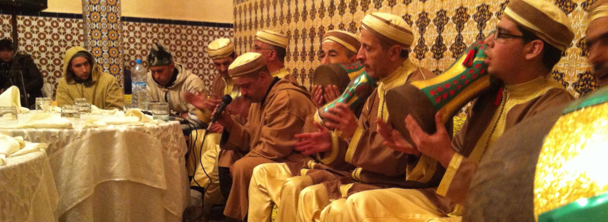

This set of short essays describes core elements of rhythm by prioritizing perception with three goals in mind. First, I aim to introduce some terminology that can inform how we hear and understand what we listen to. These elements may prove more or less helpful depending on the music that is playing, but they are widely applicable.

Second, the approaches here resist the western-centric methods and perspectives that commonly define things like beat, meter, and subdivision. The examples that I present—especially the ones in the final section, where I draw from my own research in Morocco—show how western perspectives are not as widely useful as they are often assumed to be. Like other global musical systems, western musical notation is derived from specific histories and compositional styles. It is a tool serving a purpose, one that is usually related to the preservation of specific elements of a composition for the sake of performance. Even within the context of western classical music, it hinders certain nuances of performance practice when used inappropriately. For this reason, I define concepts broadly with the hope that they may prove more useful across a range of musics and experiences.

And, speaking of experience, I want to focus our understanding of music and sound more holistically on the body. We do not just hear music, we feel it, dance it, sing it, and hear to the world around us through it. Yet, each of us does so differently based on our own experiences, abilities, training, hopes, dreams, and so on.

These essays are organized into four parts. The first introduces some basic concepts of rhythm through the lens of expectation. The second addresses repetition and meter using cycles, again drawing on expectation. The third moves to the micro-level by discussing beat and timing and how they impact the way we feel music. The final part uses these ideas of rhythm, expectation, and repetition to introduce and analyze three rhythmic patterns from Moroccan sacred musics that resist easy definition according to western perspectives. 

## Contents

[Part 1: Expectation and repetition](part1.html)

[Part 2: Cycles of time](part2.html)

[Part 3: Feeling the beat(s)](part3.html)

[Part 4: Consistent inconsistencies from Morocco](part4.html)

[References](references.html)

