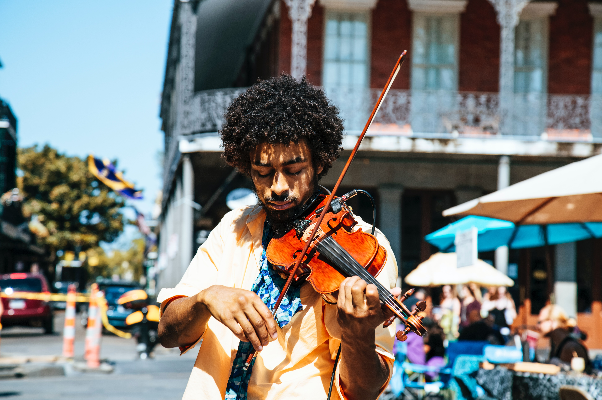
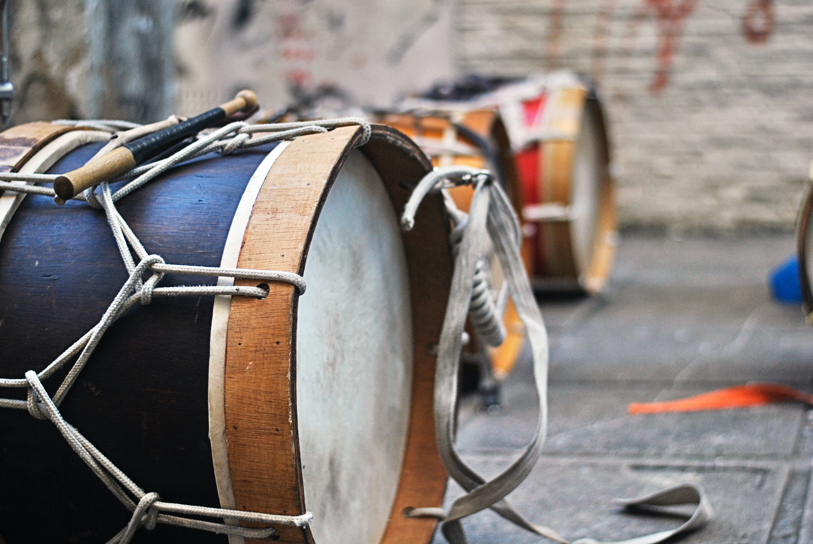

The *World Music Textbook* is a new collaborative effort to create a free and broadly accessible resource for the general public, educators, students, and researchers alike. Its open collections of scholarly, peer-reviewed writing and multimedia materials will focus on increasing access to underrepresented voices, writing styles, and audiences, all with undergraduate students and a broad readership in mind.

## Inclusive, flexible, and open

This project’s vision is the creation of an adaptable free textbook. Its short-form content will come from researchers and practitioners who address musical practices and broad themes that draw from their own experience. Filtered listings, tags, curated collections, and sample educational materials will highlight a range of methods for teaching and understanding the role of music within society, social histories, and divergent approaches to scholarship and knowledge.

With these goals in mind, we, as editors, will serve as mentors and work closely with contributors when necessary before submitting manuscripts for the peer review process. One of our foundational goals for this project is the inclusion of contributors from across and outside of the academy: this includes those for whom English remains a barrier as well as those who wish to share work developed from personal musical and cultural experience that may not conform to most current academic publication criteria. We believe that these editorial decisions to integrate mentorship and flexible formats are critical first steps in overcoming entrenched structural and institutional boundaries. We plan to continue the process of identifying and dismantling barriers to provide the levels of openness and accessibility deserved by the public, researchers, and students alike.

While this project is still in development, we have a sample of the type of undergraduate- and general audience-focused writing that we intend to include. We also encourage submissions in other formats, including short documentary videos, interviews and oral histories, or interactive projects that take advantage of the opportunities of online delivery.

<a href="pages/nielsen/" class="btn">"Communities and Identities in Danza Azteca" by Kristina Nielsen</a>

The *World Music Textbook* will also present annotated collections of other resources that are available across the web (see the link above for examples). If you manage or know of a resource that warrants consideration for this annotated list, please contact the editors at [{{ site.email}}](mailto:{{ site.email }}) for consideration.

<small>*"Musician busking" by William Recinos on [Unsplash](https://unsplash.com/@iwillbmm)*</small>

## Editorial team

If you have any questions about this project, using the resources, the submission or review process, or would like to be involved, please contact the editors at [{{ site.email}}](mailto:{{ site.email }}).

The *World Music Textbook* editors are:

* [Kristina Nielsen](https://www.smu.edu/Meadows/AreasOfStudy/Music/Faculty/NielsenKristina)
* [Jessie Vallejo](https://www.cpp.edu/class/music/faculty-staff/jessie-vallejo.shtml)
* [Christopher Witulski](https://www.bgsu.edu/musical-arts/faculty-and-staff/christopher-witulski.html)

The current *World Music Textbook* editorial board:

* [Guillermo “Willie” Acuña](https://www.santamonicayouthorchestra.org/personnel/willie-acuna)
* [Christopher Ballengee](https://www.aacc.edu/about/schools-of-study/liberal-arts/performing-arts/christopher-ballengee/)
* [Christen Blanton](https://vpa.uncg.edu/home/directory/bio-christenblanton/)
* [Tara Browner](https://schoolofmusic.ucla.edu/people/tara-browner/)
* [Shihwei Carrasco-Wu](http://www.shihweiwu.com/)
* Daniel Castro Pantoja
* [Ganavya Doraiswamy](https://www.ganavya.com)
* [Ryan Ebright](https://www.bgsu.edu/musical-arts/faculty-and-staff/ryan-ebright.html)
* [Andrew Gobin](https://tulaliplushootseed.com/andrew-gobin/)
* [Jennie Gubner](https://cfa.arizona.edu/profile/jgubner/)
* [Frank Gunderson](https://music.fsu.edu/person/frank-gunderson)
* [Deonte Harris](https://scholars.duke.edu/person/Deonte.Harris)
* [Damascus Kafumbe](http://www.middlebury.edu/academics/music/faculty/node/288377)
* [Peter Kupfer](https://www.smu.edu/Meadows/AreasOfStudy/Music/Faculty/KupferPeter)
* [Maxi Larrea](https://maximilianolarrea.com)
* [David Lewis](https://libguides.bgsu.edu/prf.php?account_id=152381)
* [Scott Linford](https://ccm.uc.edu/about/directory.html?eid=linforsv&thecomp=uceprof_0)
* [Scott Marcus](https://music.ucsb.edu/people/scott-marcus)
* [Yuxin Mei](https://mhte.music.unt.edu/yuxin-mei)
* [Katherine Meizel](https://www.bgsu.edu/musical-arts/faculty-and-staff/katherine-meizel.html)
* [Tanya Merchant](https://music.ucsc.edu/faculty/tanya-merchant)
* [Mark Miyake](https://fairhaven.wwu.edu/users/miyakem/)
* [Kiran Rajagopalan](http://www.kiranrajagopalan.com)
* [Megan Rancier](https://www.bgsu.edu/musical-arts/faculty-and-staff/megan-rancier.html)
* [Anne Rasmussen](https://www.wm.edu/as/music/directory/rasmussen_a.php)
* Ryan Shiotsuki
* [Henry Stobart](https://pure.royalholloway.ac.uk/portal/en/persons/henry-stobart_f947dd36-8cec-4f0e-af22-8bd143b07a9c.html)
* [Ty-Juana Taylor](http://www.tyjuanataylor.com/)
* [Kojiro Umezaki](https://kojiroumezaki.com/)
* [Vivek Virani](https://mhte.music.unt.edu/faculty/vivek-virani)
* [Zachary Wallmark](https://music.uoregon.edu/people/faculty/zwallmar)
* [Renata Yazzie](https://renatayazzie.wordpress.com/)

<small>*"Afaia (maracatu drums)" by Paulo Infante on [Unsplash](https://unsplash.com/@pauloinfante)*</small>

## What should your ideal world music textbook do?

With our aim to provide a collaborative and open free resource for instructors and students alike, we invite you to share any ideas about what you wish you had available for your students.

<form
  action = "https://formspree.io/{{ site.email }}"
  method="POST">

  <textarea name="suggestions" rows="4" placeholder = "I have some thoughts"></textarea>

  

    If you would like to be involved, please contact the editors. For updates, join our mailing list by entering your email below. We will not sell or share your responses without your permission.
  

  

    <input type="text" name="name" placeholder="Your name (optional)" size = "50">
    <input type="text" name="email" placeholder="Your email (optional)" size = "50">
     

    <input type = "submit" class="btn" value = "Send">
  

</form>

<small>*"party fans raised their hands" by Anthony Delanoix on [Upstream](https://unsplash.com/@anthonydelanoix)*</small>
