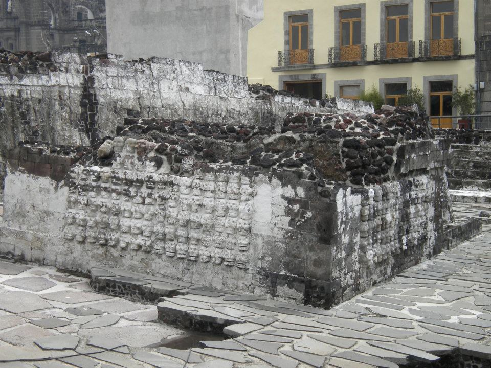
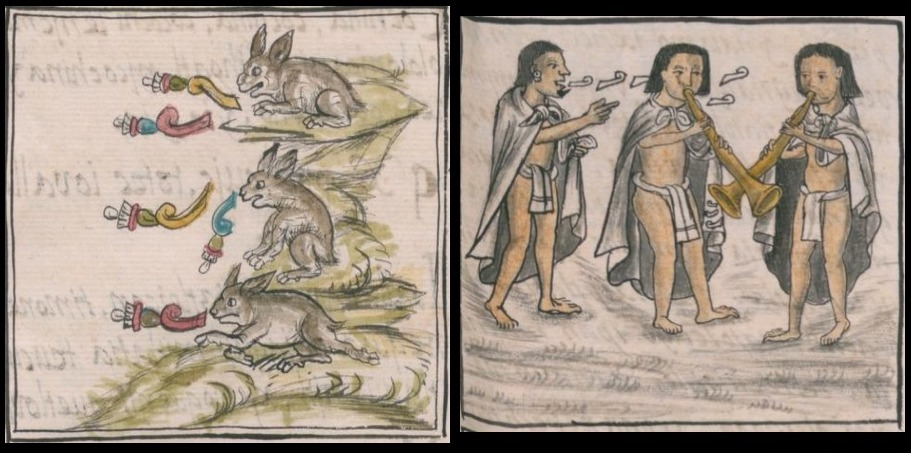

In March 2016, I traveled from my home in Los Angeles, California, to the annual Mexica New Year Celebration in San Jose, located about an hour south of San Francisco. From the edge of the roped off circle, I watched as my friends from Southern California danced to the reverberating beats of the Aztec log drums, joining hundreds of other dancers from across the United States. Together, they danced around the drums in colorful regalia. While the New Year's celebration is a highly social event with vendors and food, the dancing is also a form of ceremony and offering, and danzantes sacrifice their bodily comfort through hours of continuous dance. Each movement is accentuated through the sounds of rattles on their legs, known as *ayoyotes*, that are made out of seedpods. As they dance, copal—a fragrant, ceremonial tree sap—drifts through the air.

 
<small>*Figure 1. Mexica New Year Ceremony in San Jose, California in March 2016.*</small>

The *Mexica* people ruled the Aztec Empire from the capital of Tenochtitlan, and at its peak in the 1500s it spanned from the Pacific Coast to the Caribbean. The Empire included Indigenous people of many different cultures who paid tribute (similar to taxes) to the Mexica. The Americas were forever changed with the arrival of Europeans in the late 1400s. In 1519, Hernán Cortés arrived in Tenochtitlan with his soldiers, often referred to as *conquistadores*, and on August 13th, 1521, they defeated Tenochtitlan. Upon the ruins of the former capital, the Spanish established present-day Mexico City as the new capital of the colony of New Spain.

 
<small>*Figure 2. The excavated ruins of a pyramid in the central square with a colonial-era building behind it*</small>

In the decades that followed the fall of Tenochtitlan, the Spanish decimated traditional Mexica music and culture, which the Spanish associated with the Devil (Sahagun trans. Anderson and Dibble 1951:207; Tavárez 2011:35). Without the ability to time travel, it is virtually impossible to know exactly what these dances may have been, what the music sounded like, or what they meant to the Mexica. Nonetheless, there are many song texts, artifacts, documentation of Mexica spirituality, descriptions of music and dance performances, and images of musicians and dancers.[^1]

These images and descriptions of music and dance gained significance in the twentieth century after the Mexican Revolution. Following decades of conflict, the political leadership of Mexico sought to unite the many diverse communities across Mexico through a single shared national identity (Gamio \[1916\]2010; Klor de Alva 1992; Alonso 2004). To achieve this goal, Mexico and its nationalist thinkers forwarded the concept of *mestizaje*, or European and Indigenous racial and cultural mixing (Vasconcelos \[1925\]1979; Brading 1988).[^2] In pursuit of this goal, musicians, artists, and dancers in Mexico City turned to symbols from the Aztec Empire to shape a shared national cultural heritage (See González Torres 2005; Rostas 2009; Saavedra 2015).

Despite the push for cultural homogeneity from national leadership, Mexico remains a pluricultural society. Today there are more than seventeen million Indigenous people in Mexico who speak over sixty-eight Indigenous languages (Working Group on Indigenous Populations 1995; Instituto Nacional de Lenguas Indígenas Nacionales 2008). For official recognition as Indigenous peoples, communities and individuals must meet a number of criteria required by nations and international organizations. For instance, to receive official recognition, the United Nations requires self-identification as Indigenous as well as acceptance of the claim by the community (United Nations Permanent Forum on Indigenous Issues). They also require historical continuity extending to before colonialism, connections to land and territories, and cultural continuity including language, rituals, and social structures (ibid.). On a national level, Mexico continues to confer Indigenous status predominantly based upon the ability to speak an Indigenous language (Comisión Nacional para el Desarrollo de los Pueblos Indígenas 2006:131). In contrast, the United States federal government recognizes Indigenous people—also known as Native Americans or American Indians—predominantly through heritage, including metrics like "blood quantum" (Garoutte 2003:15). While virtually all of the danzantes have Indigenous Mexican ancestry, very few participants in Danza Azteca meet the stringent requirements of the United Nations or national governments for official recognition as Indigenous individuals.

Bearing these contexts in mind, what are danzantes performing at gatherings like the Mexica New Year Ceremony given that Mexica music and ritual culture was decimated following the arrival of the Spanish? And what do these performances reveal regarding the significance of music and dance in shaping how danzantes think about their identities and Indigenous heritages? In this essay, I unpack these two critical questions using a theoretical framework known as "articulation theory." This theoretical framework was developed by Stuart Hall, a British-Jamaican sociologist and cultural studies researcher who worked extensively with understandings of identity, popular culture, and race (Hall 1986; Grossberg 1996; DeLuca 1999; Clarke 2015). Drawing on Hall's work, I explore the ways in which music and dance have come to play critical roles in shaping identities within Danza Azteca communities.

## Music at the Mexica New Year Ceremony

<iframe width="560" height="315" src="https://www.youtube.com/embed/kb4O0rVHBhM" frameborder="0" allow="accelerometer; autoplay; encrypted-media; gyroscope; picture-in-picture" allowfullscreen></iframe>
<small>*Video Example 1. Example of a dance from the 2016 Mexica New Year Ceremony in San Jose, California hosted by Calpulli Tonalehqueh*</small>

As can be heard in Video Example 1, the music at the Mexica New Year ceremony meets many expectations listeners might have for what an ancient Aztec music should sound like. The instruments the musicians play are replicas, or models, of historical instruments from across Mesoamerica that are commonly found in museum collections today. Additionally, instruments that have European origins, such as string instruments, are largely absent, even though they were important in a key predecessor to Danza Azteca, known as conchero. Furthermore, many songs at the ceremony are sung in Nahuatl, the language spoken by the Mexica (González Torres 2005; Rostas 1991, 2009).

Since the arrival of Europeans, Indigenous music has become intertwined with European music through a process known as *syncretism*. In short, syncretism combines two or more cultures into a new cultural entity. In Central Mexico, Indigenous musicians adapted string instruments into their music, and Indigenous spiritual beliefs blended with Catholicism. For instance, Conchero communities blended Indigenous spiritual beings with Jesus and Catholic saints (Stone 1975:195). The Aztec musicians I have spoken with in Los Angeles have experimented with instruments and  what music may have sounded like prior to European musical and religious influences. Many musicians who perform on Aztec instruments have conducted extensive research on Aztec history and spirituality, the Nahuatl language, and music. In their research, they draw heavily on historical sources, including accounts from the colonial era that were written by both Indigenous and Spanish observers. They also draw on music and dances from the many Indigenous communities in Mexico—and even sometimes the United States—that continue to the present day. These efforts are particularly complicated since cultures and traditions are always changing, even if only ever so slightly. While many Indigenous cultures in Central Mexico continue traditions that likely originated before the arrival of the Spanish, these traditions are unlikely to have been exactly the same as Mexica rituals or musical practices in Tenochtitlan.

 
<small>*Figure 3. Images from the Florentine Codex that was written in the 1500s by Nahua scribes*</small>

In addition to written and community sources, musicians performing on Mesoamerican instrument replicas also draw on their own creativity, experiences, identities, and interpretation of what the Aztec past might have been like. For instance, Carlos Daniel Jimenez Vasquez, a danzante who also plays an array of Indigenous instruments, shared that he tries to imagine what a dance might reflect and integrates instruments accordingly. He considers events like battles or celebrations and tries to describe them musically (Personal Interview 2015). Vasquez also performs music that draws on his Zapotec heritage from his hometown of Maquilxochitl in the state of Oaxaca. In particular, he draws inspiration from traditional flute music from Oaxaca. While Vasquez is fully of Zapotec descent, he did not learn the language and he is not eligible for official recognition as Indigenous in the United States.

Cuezalin, another danzante and musician, similarly draws on his Indigenous Cora-Tepehuan heritage. Cuezalin has conducted extensive research with historical texts to inform his composition of new dances and songs. Cuezalin lives in Santa Ana where he leads a dance community called Xiuhcoatl, meaning "turquoise serpent" in Nahuatl. At the Mexica New Year ceremony, Cuezalin led a dance and song called "Zan Yehuan" that he developed along with companions in a group called the Xochimecayahualli from Southern California (Personal Interview 2015) (see Video Example 2). The song draws on a Nahuatl text by the king and poet Nezahualcoyotl who governed the city of Texcoco in the 1500s (León-Portilla 1992:97). To adapt the song text for modern performance, Cuezalin and the Xochimecayahualli have shifted lines of the text, composed a new melody, and added dance steps. In the performance, the dancers move in an interlocked line holding hands. Cuezalin then transitions this dance to a popular Mexican song "La Víbora" or "the snake" that uses the same rhythms and dance steps.

<iframe width="560" height="315" src="https://www.youtube.com/embed/R920ZHGmt-c" frameborder="0" allow="accelerometer; autoplay; encrypted-media; gyroscope; picture-in-picture" allowfullscreen></iframe>
<small>*Video Example 2. Cuezalin leading “Zan Yehuan” at the Mexica New Year Ceremony in San Jose, California*</small>

## Danza and Articulation Theory

Stuart Hall's articulation theory provides one useful vantage point for considering the ways in which music and dance are shaping how danzantes interpret their identities. Hall suggested that identities and communities are constantly being formed by coupling and decoupling different elements together (Hall 1986; Grossberg 1996). Hall likened this process to a truck with multiple interchangeable trailers in a conversation with fellow sociologist Lawrence Grossberg (1996). Hall points out that these elements are not permanently fused but rather flexible. New elements can be coupled together (and in turn decoupled), and in the process they can change how individuals and communities identify.

Articulation theory provides a way of thinking about these music and dance elements that are being connected by individuals and communities within Danza Azteca. Danzantes can identify with Mexican national heritage through the Aztec symbols promoted in twentieth-century nation-building projects. They can also identify with their Indigenous heritages through these same performances. This can provide a forum for celebrating Indigenous ancestors despite not meeting the strict criteria for Indigenous recognition. Music and dance become important resources for navigating the challenges many danzantes face in having Indigenous heritage and culture yet not receiving recognition. Through music and dance, danzantes celebrate their heritage while circumventing and challenging Mexican and U.S. definitions of Indigenous people that frequently overlook Indigenous cultures in Mexico and along the U.S. Mexican border.

"Zan Yehuan" from the Mexica New Year ceremony is an example where music and dance offer insight into how diverse elements of the danzantes' individual and communal identities are combined. All the elements—the ancient Nahuatl text, the new melody composed in Southern California by Cuezalin and the Xochimecayahualli, and the heartbeat rhythm—connect danzantes with different aspects of their Indigenous heritages through the umbrella of Aztec culture. Cuezalin and other musicians draw from their own Indigenous heritages and their personal creativity. Cuezalin and the Xochimecayahualli simultaneously draw on the Nahuatl text to forge a relationship with the past. I interviewed Cuezalin about these songs, and he shared why this text is so meaningful to him:

> I believe that their power is in the connection they establish to the words of the ancients. And when we pronounce the words that they pronounced, that for them were special, when we sing their songs we are transported to an ancient time—to a time that unites many of us that are descended from the Aztecs, so to speak, the people that spoke in those times. Even though our ancestors may not have been Nahuatl speakers at that time, these are words that were spoken in the time that our ancestors lived. Therefore, they transport us like a time capsule ... It is a gem, a physical thing that can be sung, that one can say. Someone might, for example, have a mask or a piece of old jade, but only one person can have that. A song is different. A song can belong to many people, and you can protect it and care for it. That is the power of the spoken word. (Personal Interview with Cuezalin 2015)

<iframe width="560" height="315" src="https://www.youtube.com/embed/SatasmBx0oM" frameborder="0" allow="accelerometer; autoplay; encrypted-media; gyroscope; picture-in-picture" allowfullscreen></iframe>
<small>*Video Example 3. Cuezalin performing “Zan Yehuan” and discussing the origins of the song*</small>

At the same time, as demonstrated and discussed by Cuezalin in Video Example 3, the transition into "La Víbora" highlights a shared Mexican identity, using a song common in Mexican celebrations, such as weddings. For danzantes, these musical elements and their interwoven identities, both ethnic and national, are not exclusive: They exist simultaneously. Through music and dance, danzantes can emphasize one element and then another, using music to temporarily bring different aspects of their identities to the forefront while simultaneously celebrating all of them collectively.

## Additional Materials

### Discussion Questions

1.  Consider the many different types of music that you listen to and perform in the different settings of your life *(religious services, family functions, cultural or ethnic celebrations, hanging out with college friends v. childhood friends, and other communities in which you participate)*.

    * In what ways does your identity change in these different settings?

    * What are some ways in which you may be coupling and decoupling elements together to shape your identity through music?

2.  As we explored above, history is a frequent theme in Danza Azteca. Why do you think history is so important to the danzantes?

    * Can you think of other examples, possibly from your own life, where a song or piece of music is important to you or others because of its history?

### Recommended Readings

{:.hang}
Garroutte, Eva Marie. 2003. *Real Indians: Identity and the Survival of Native America*. Berkeley: University of California Press.

{:.hang}
Nájera-Ramírez, Olga, Norma Elia Cantú and Brenda M. Romero, eds. 2009. *Dancing Across Borders: Danzas y Bailes Mexicanos*. Urbana: University of Illinois Press.

{:.hang}
Scolieri, Paul A. 2013. *Dancing in the New World: Aztecs, Spaniards, and the Choreography of Conquest.* Austin: University of Texas Press.

### Digital Resources

{:.hang}
*[General History of the Things of New Spain by Fray Bernardino de Sahagún: The Florentine Codex](https://www.wdl.org/en/item/10096/)*. World Digital Library.

> A digitized version of the Florentine Codex, which was drafted in the 1500s by Indigenous scribes and the monk Bernardino de Sahagún in the decades following the fall of Tenochtitlan. This book describes the religion, life, history, and songs of Nahua people of Central Mexico.

{:.hang}
[*UCLA Ethnomusicology Archive, Collection 2017.02*](https://archive.org/details/calauem_201702_item_16_6-9/DSC_0003_Cuezalin+talking+about+and+playing+Maquil+Xochitl+and+Nayeli.MOV). Collected by Kristina Nielsen.

> Watch Cuezalin discuss his composition process and demonstrate rhythms and dances.

### Works Cited

{:.hang}
Alonso, Ana María. 2004. "Conforming Disconformity: 'Mestizaje,' Hybridity, and the Aesthetics of Mexican Nationalism." *Cultural Anthropology* 19(4): 459-90.

{:.hang}
Brading, David A. 1988. "Manuel Gamio and Official Indigenismo in Mexico." *Bulletin of Latin American Research* 7(1): 75-89.

{:.hang}
Clarke, John. 2015. "Stuart Hall and the Theory and Practice of Articulation." *Discourse: Studies in the Cultural Politics of Education* 36(2): 275-286.

{:.hang}
Comisión Nacional para el Desarrollo de los Pueblos Indígenas. 2006. ["Informe sobre desarrollo Humana de los pueblos indígenas de México."](http://www.cdi.gob.mx/idh/informe_desarrollo_humano_pueblos_indigenas_mexico_2006.pdf) Accessed 6 May 2020.

{:.hang}
DeLuca, Kevin. 1999. "Articulation Theory: A Discursive Grounding for Rhetorical Practice." *Philosophy & Rhetoric* 32(4): 334-48.

{:.hang}
Gamio, Manuel. 2010. *Forjando Patria: Pro-Nacionalismo*, translated by Fernando Armstrong-Fumero. Boulder: University Press of Colorado.

{:.hang}
González Torres, Yólotl. 2005. *Danza Tu Palabra: La Danza de Los Concheros*. Mexico City: Conaculta-INAH.

{:.hang}
Grossberg, Lawrence. 1996. "On Postmodernism and Articulation: An Interview with Stuart Hall." In *Stuart Hall: Critical Dialogues in Cultural Studies*, edited by David Morley and Kuan-Hsing Chen, 131-51. New York: Routledge.

{:.hang}
Hall, Stuart. 1986. "Gramsci's Relevance for the Study of Race and Ethnicity." *Journal of Communication Inquiry* 10(2): 5-27.

{:.hang}
Hall, Stuart. 2002. "Race, Articulation and Societies Structured in Dominance." In *Race Critical Theories: Text and* Context, edited by Philomena Essed and David Theo Goldberg, 38-68. Oxford: Blackwell Publishers.

{:.hang}
International Work Group for Indigenous Affairs. 2019. ["Indigenous Peoples in Mexico."](https://www.iwgia.org/en/mexico.html) Accessed April 9, 2020.

{:.hang}
Instituto Nacional de Lenguas Indígenas Nacionales. 2008. ["Catálogo de las Lenguas Indígenas Nacionales: Variantes Lingüísticas de México con sus Autodenominaciones y Referencias Geoestadísticas."](https://www.inali.gob.mx/pdf/CLIN\_completo.pdf) *Diario Oficial*. Accessed April 9, 2020

{:.hang}
Klor de Alva, J. Jorge. 1992. "Introduction: Nahua Studies, The Allure of the 'Aztecs,' and Miguel León-Portilla." In *The Aztec Image of Self and Society: An Introduction to Nahua Culture*, edited by J. Jorge Klor de Alva, vii-xxiii. Salt Lake City: University of Utah Press.

{:.hang}
Knight, Alan. 1990. "Racism, Revolution, and Indigenismo: Mexico, 1910-1940." In *The Idea of Race in Latin America, 1870-1940*, edited by Richard Graham, 71-113. Austin: University of Texas Press.

{:.hang}
León-Portilla, Miguel. 1992. *Fifteen Poets of the Aztec World*. Norman: University of Oklahoma Press.

{:.hang}
Nielsen, Kristina. 2014. ["The Role of Interpretation in Determining Continuity in Danza Azteca History."](https://ethnomusicologyreview.ucla.edu/content/role-interpretation-determining-continuity-danza-azteca-history) *Ethnomusicology Review*. Accessed April 9, 2020

{:.hang}
Rostas, Susana. 1991. "The Concheros of Mexico: A Search for Ethnic Identity." *Dance Research: The Journal of the Society for Dance Research* 9(2): 3-17.

{:.hang}
­­­------. 2009. *Carrying the Word*. Boulder: University of Colorado Press.

{:.hang}
­­­------. 2002. "'Mexicanidad' The Resurgence of the Indian in Popular Mexican Nationalism." *The Cambridge Journal of Anthropology* 23(1): 20-38.

{:.hang}
Saavedra, Leonora. 2015. "Carlos Chávez and the Myth of the Aztec Renaissance." In *Carlos Chávez and His World*, edited by Leonora Saavedra, 134-165. Princeton: Princeton University Press.

{:.hang}
Sahagún, Bernardino de. 1951 \[1540-1585\]. *Florentine Codex Book II* translated by Arthur Anderson and Charles Dibble. Santa Fe: The School of American Research and the University of Utah.

{:.hang}
Tavárez, David. 2011. *The Invisible War: Indigenous Devotions, Discipline, and Dissent in Colonial Mexico*. Stanford: Stanfor University Press.

{:.hang}
Tuzi, Grazia. 2013. "The *Voladores* Dance: On the Use of Evidence from the Past to Interpret the Present." In *Flower World: Music Archaeology of the Americas* Volume 2, edited by Matthias Stöckli and Arnd Adje Both, 159-176. Berlin: Ekho Verlag.

{:.hang}
United Nations Permanent Forum on Indigenous People. ["Factsheet."](https://www.un.org/esa/socdev/unpfii/documents/5session\_factsheet1.pdf) Accessed April 9, 2020.

{:.hang}
Vasconcelos, José. 1979 \[1925\]. *The Cosmic Race: La raza cósmica*. Trans. Didier T. Jaén. Baltimore: John Hopkins University Press.

## Notes

[^1]: This does not mean that there is not continuity, only that without reliable sources these continuities cannot be verified. For analyses that have explored how continuity might be determined, see Grazia Tuzi's *The Voladores Dance: Traces of the Past for the Interpretation of the Present* (2013) and a deeper exploration of the idea of continuity and breaks in the danza tradition (Nielsen 2014).

[^2]: There are large African and Asian communities in Mexico who have made important cultural contributions to music and dance. While these are sometimes included in the idea of *mestizaje*, they were discriminated against by many Mexican national thinkers in the early twentieth century and not fully included in the national ideology of mestizaje (Vasconcelos 1979:43-44; Knight 1990:97). For that reason, I focus on Europeans and Spanish traditions that are important to Danza Azteca.
